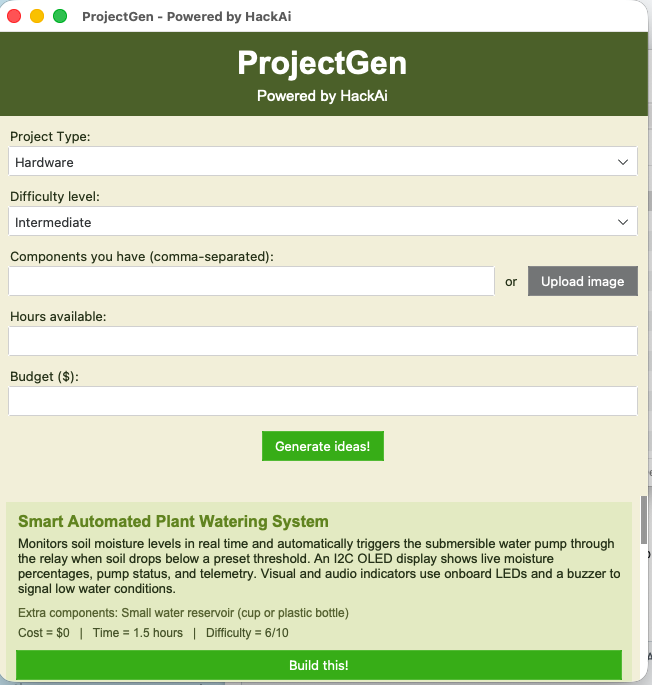
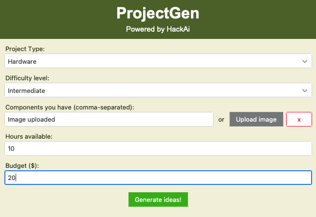
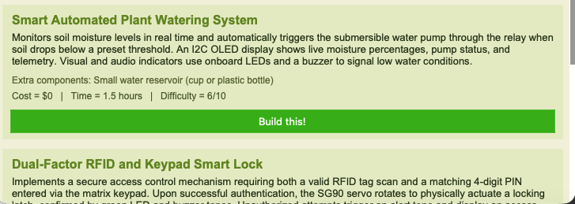
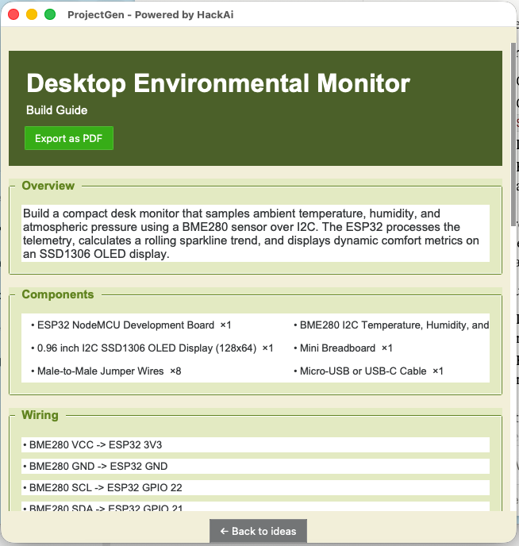

# ProjectGen

ProjectGen is an project idea generator powered by HackAI designed to help us tinkerers quickly come up with project ideas we can actually make, tailored to our specific needs, taking things like available components, time, budget, and difficulty level into account.

Instead of a lot of time trying to think of a project idea, you can tell ProjectGen what you have, and it will generate 5 project ideas that fit your requirements.



## Features

* AI project idea generation
* Hardware and software project modes
* Component input for hardware projects + photo upload feature
* Adjustable time and budget
* Difficulty level selection
* Programming language selection for software projects
* Detailed project descriptions
  * Estimated cost and build time
  * Extra components section
  * Detailed build guides
    * Hardware wiring instructions
    * Code + with button to copy it
    * PDF exporting
* Previus session saving
* macOS `.app` and Windows `.exe` versions

## Interface

ProjectGen uses a simple GUI powered by `tkinter` and `ttkbootstrap` where you can enter your project specifications and generate project ideas.

For hardware projects, you can enter the components you have, or upload a photo of your components drawer instead, to avoid the hassle of having to type each one of them out by hand.



You can choose between:

* Hardware Project
and
* Software Project

For hardware projects, you must also write:

* Components
* Available time
* Budget
* Difficulty level

For software projects, you must specify:

* Programming language
* Available time
* Difficulty level

## Generated Ideas

After generating ideas, the app displays multiple project cards with information about each project.

Each card has:

* Project name
* Description
* Extra components
* Estimated cost
* Estimated time
* Difficulty level
* "Build this!" button



Once the ideas are shown, the suer can press the "Build this!" button to get specific instructions to build it.

## Build Guides

ProjectGen can generate a full build guide for the project.

The guide contains:

* Project overview
* Components
* Wiring (for hardware projects)
* Step-by-step instructions
* Code (when is needed)



For hardware projects, the wiring section explains says the components should be connected.

For software projects, the wiring section is not shown, since it is not needed.

The code can also be copied directly from the window, with the "Copy code" button.

## How It Works

ProjectGen is built using Python and uses an AI model from Hack Club AI, making the request using OpenRouter.

You first enter the components you have and the other project requirements. ProjectGen then sends this information to the AI model and asks it to generate project ideas that match these requirements.

The AI returns the ideas in a structured JSON format, which ProjectGen then uses to create the project cards and then the build guides.

For hardware projects, ProjectGen can also use an uploaded image of the user's component drawer, instead of manually typed components.

## AI

ProjectGen currently uses Google's "gemini-3.8-flash" model through Hack Club AI, mainly because it's fast, but that can be changed in the future to accomodate other needs.

The app uses specific prompts so that the AI returns information in structured JSON. This makes it possible for ProjectGen to automatically display things such as cost, difficulty, components, wiring, and code in the correct cards/sections of the UI, by converting the json into a python dictionary and accesing all the different variables seoerately.

## Building

ProjectGen can be run directly from Python, or packaged into a complete app using `PyInstaller`.

### Run from source

```bash
pip install -r requirements.txt
python main.py
```

### macOS

The macOS version is packaged using PyInstaller into a `.app` application.

### Windows

Since I coded ProjectGen on macOS, I used GitHub Actions to build the Windows version remotely.

The workflow (written by AI):

* Sets up a Windows environment
* Installs the required Python packages
* Runs PyInstaller
* Packages the application
* Creates a ZIP file containing the Windows build
* Uploads it as a GitHub Actions artifact

I then used a Windows VM in UTM to test the generated `.exe`.

## Current Status

ProjectGen is currently shipped.

What I've done so far:

* AI project idea generation
* Hardware project mode
* Software project mode
* Component input
* Component image upload
* Time and budget limits
* Difficulty selection
* Programming language selection
* Generated project cards
* Detailed build guides
* Hardware wiring sections
* Conditional wiring display
* Code generation
* Copy code button
* PDF exporting
* Session saving
* API key handling
* macOS application packaging
* Windows application packaging
* GitHub Actions Windows builds
* GitHub release
* Windows VM testing

More stuff I could do:

* More testing
* More UI improvements
* More AI improvements
* Additional features based on user feedback

## Design

ProjectGen uses a simple GUI designed to make the process of going from just a project idea to an actual finished product as fast as possible.

The interface uses different sections/cards to separate the project requirements, generated ideas, and build guides.

The app was designed around the idea that you don't need to already know exactly what you want to build. You can just enter what you have and let ProjectGen come up with the ideas.

The ProjectGen icon was designed specifically for the application, by first making a prototype in canva and then enhancing it using AI.

## Built With

* Python
* Tkinter
* ttkbootstrap
* OpenRouter
* Hack Club AI Proxy
* Gemini
* PyInstaller
* GitHub Actions
* PyObjC
* ReportLab
* VS Code

## AI Usage

I used AI throughout the development of ProjectGen, mainly for:

* Code debugging: Finding and fixing bugs and errors + getting help with Tkinter and ttkbootstrap.
* Packaging: Getting help with PyInstaller issues and creating the macOS application.
* Windows .exe: Creating the GitHub Actions workflow used to build the Windows `.exe`.
* Icon issues: Debugging the macOS dock icon and using PyObjC to re-apply it.
* App icon: Enhancing the app icon prototype I designed in Canva.

The actual project idea, design, UI, feature decisions, testing, and development were done by me.

--- 
**Made by Harry Fanouriakis**
